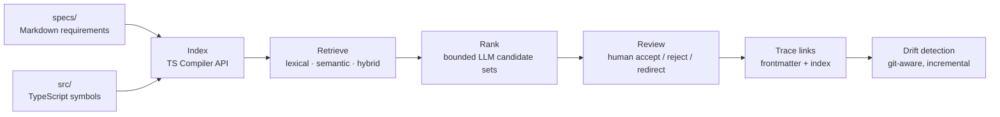

# SpecTrace

**Requirements traceability for Markdown specifications and TypeScript code.**

SpecTrace links requirements written in Markdown to the symbols that implement
them, keeps every link under human review, and detects when the two drift apart
as the repository evolves.

[](https://github.com/GhostHarborGG/SpecTrace/actions/workflows/ci.yml)
[](specs/spectrace-build-plan-with-claude.md)
[](https://nodejs.org)
[](https://www.typescriptlang.org)
[](https://pnpm.io)
[](#license)

> **Status: pre-1.0, under active development.** The engine and CLI are being
> built requirement by requirement against a frozen specification. Interfaces
> will change until `v1.0.0`. See [Project status](#project-status).

---

## The problem

Specifications go stale. A requirement says the tool exits `3` on validation
failure; six months of refactoring later, nobody can say which function still
honors that, or whether the requirement was quietly abandoned. Traceability
matrices answer the question, but maintaining one by hand is the reason almost
nobody does.

SpecTrace maintains that matrix from the artifacts teams already keep — the
Markdown specs and the source tree — and treats every proposed link as a
suggestion a human accepts, rejects, or redirects.

## How it works



Design commitments that shape everything else:

- **Retrieval-first.** Cheap local retrieval bounds the candidate set; the
  language model only ranks what retrieval already surfaced. Cost stays
  proportional to changed work, not repository size.
- **No unattended links.** The engine proposes; a human decides. Accept,
  reject, and redirect decisions are stored separately from the links
  themselves, so the audit trail survives re-analysis.
- **Local by default.** Indexing, retrieval, storage, and drift detection run
  on your machine. Only bounded candidate sets ever leave it.
- **The spec is the source of truth.** Requirement bodies live one-per-file in
  `specs/requirements/`; the narrative documents index them, and those index
  tables are generated and CI-guarded, never hand-written.

## Project status

The build plan is **gated by exit criteria, not calendar dates** — a phase ends
when its gate is green. Two gates are closed.

| Phase | Focus | Gate |
|---|---|---|
| **A** | Foundations & feasibility | ✅ **Closed 2026-08-02** — GO on retrieval quality |
| **B** | Schema freeze, dataset & Studio skeleton | ✅ **Closed 2026-08-02** — all three criteria met |
| **C** | Indexing & retrieval, evaluated | 🔨 **In progress** — Recall@k for configurations A and B, report-ready |
| **D** | Ranking & review (+ Studio sync/analysis) | ⏳ Planned |
| **E** | Navigation & the review queue | ⏳ Planned |
| **F** | Drift detection, both surfaces | ⏳ Planned |
| **G** | Evaluation, case study & full dogfood | ⏳ Planned |
| **H** | Write-up, polish & public release (`v1.0.0`) | ⏳ Planned |

**Phase A** established feasibility on a frozen third-party repository
(`unjs/hookable` v6.1.1) against 24 human-labeled ground-truth links. The
selected lexical configuration (BM25F, `bm25f-v5`) reached **Recall@5 0.750,
Hit@5 91.7%, Hit@10 100%, MRR 0.515**, independently reproduced with
byte-identical artifacts. Failure modes and negative results — including two
measured-and-reverted ranking variants — are written up in
[`docs/feasibility-error-analysis.md`](docs/feasibility-error-analysis.md).

**Phase B** froze the schema and split the engine contract out of the CLI spec.
`spectrace init` and `spectrace validate` run clean over this repository's own
vault (55 requirements, 0 violations), and Studio opens the vault read-only.

### Requirement progress

55 requirements across three specification documents, tracked one file per
requirement in [`specs/requirements/`](specs/requirements/):

| Family | Scope | Implemented | Partial | Proposed | Total |
|---|---|--:|--:|--:|--:|
| `REQ-CORE` | Engine: schema, index, retrieval, ranking, links, drift | 8 | 1 | 17 | 26 |
| `REQ-CLI` | Command surface | 3 | 1 | 5 | 9 |
| `REQ-APP` | Studio (desktop app) | 0 | 1 | 19 | 20 |
| | **Total** | **11** | **3** | **41** | **55** |

Backed by **188 tests** across the monorepo, each mapped to a specific
acceptance criterion, run on Linux, Windows, and macOS in CI.

## Quick start

Requires **Node ≥ 20** and **pnpm 10**.

```bash
git clone https://github.com/GhostHarborGG/SpecTrace.git
cd SpecTrace
pnpm install
pnpm build
pnpm test
```

Run the CLI from source:

```bash
pnpm cli --help                       # nine commands
pnpm cli init                         # scaffold .spectrace/ config + templates
pnpm cli validate --json              # validate the requirement vault
pnpm cli index --json                 # build the symbol index
```

SpecTrace traces itself — the commands above run against this repository's own
`specs/` vault, which is both the specification and the dogfood target.

### Setting up a new workstation

Quick start is the whole install on a machine that already has the toolchain.
From a bare checkout, work through the six steps below — step 4 is a trap that
fails silently, and steps 5 and 6 are conditional. Where a command differs by
platform, both forms are given; everything else is identical on macOS, Windows,
and Linux.

**1. Node ≥ 20.** Any install method works; `node -v` should report 20 or
later. CI runs Node 22 across the Ubuntu, Windows, and macOS matrix.

**2. pnpm 10, via Corepack.** The exact version is pinned in the root
`package.json` `packageManager` field, so let Corepack read it rather than
installing pnpm globally:

```bash
corepack enable       # ships with Node; downloads the pinned pnpm on first use
pnpm -v               # 10.14.0
```

On Windows, `corepack enable` writes its shims into the Node installation
directory, so run it from an **Administrator** shell — without elevation it
fails with `EPERM` and `pnpm` stays unresolvable.

**3. Install, build, verify.** From the repository root:

```bash
pnpm install
pnpm build
pnpm typecheck
pnpm test
pnpm spec:index:check     # requirement tables match specs/requirements/
```

A healthy checkout is green on all four checks. They are also exactly what CI
runs, in the same order — if `spec:index:check` fails on a fresh clone,
something is wrong with the checkout, not with your edits.

**4. Electron's runtime binary (Studio only).** `pnpm install` may record
Electron's postinstall as complete without actually downloading the platform
binary, and neither `pnpm install` nor `pnpm rebuild` will retry it — the
postinstall is already recorded as done. Studio then dies at launch with
`Error: Electron uninstall`. Check whether the binary is there:

```bash
# macOS / Linux
ls node_modules/.pnpm/electron@*/node_modules/electron/dist
```

```powershell
# Windows (PowerShell)
Get-ChildItem node_modules\.pnpm\electron@*\node_modules\electron\dist
```

If that directory is missing, force the download by running the package's own
installer in place:

```bash
# macOS / Linux
cd node_modules/.pnpm/electron@*/node_modules/electron && node install.js
```

```powershell
# Windows (PowerShell)
Set-Location node_modules\.pnpm\electron@*\node_modules\electron
node install.js
```

A healthy result is a `dist/` directory plus a `path.txt` naming the binary
(`Electron.app/Contents/MacOS/Electron` on macOS, `electron.exe` on Windows).
Then `pnpm --filter @spectrace/studio dev` starts the app.

This affects Studio alone — core, the CLI, and the whole test suite are
unaffected, which is why CI sets `ELECTRON_SKIP_BINARY_DOWNLOAD=1` and never
needs the binary. A developer machine does.

**5. `OPENAI_API_KEY`, only if you need semantic retrieval.** Lexical retrieval
(Configuration A) needs no key and no network. Semantic and hybrid modes embed
through OpenAI `text-embedding-3`, and per REQ-CORE-021 the CLI checks for the
key up front and names it rather than failing partway through a run:

```bash
# macOS / Linux
export OPENAI_API_KEY=sk-...
```

```powershell
# Windows (PowerShell) — current session only
$env:OPENAI_API_KEY = "sk-..."
```

The embedding cache at `.spectrace/embeddings.json` is a machine-local cost
optimization and is deliberately gitignored, so it does not travel with a
clone — each workstation starts cold. A run whose corpus is fully covered by a
cache needs no key at all, so you can point `--embedding-cache <file>` at a
cache copied across from your other machine (the file is portable; it is
excluded from the repository for size, not for platform reasons) rather than
paying the one-time embedding cost twice.

**6. Line endings — leave them alone (Windows).** `.gitattributes` pins every
text file to LF with `* text=auto eol=lf`, and that is deliberate: byte-identical
index rebuilds (REQ-CORE-012 AC1) and the CLI JSON parity snapshots have to
match across Windows and macOS. Git's per-file attribute wins over a global
`core.autocrlf=true`, so the default Git for Windows setting does no harm and
needs no change. Do not "fix" a diff that looks like a whole-file line-ending
change by overriding it — that breaks snapshot parity for everyone else.

#### What does not travel between machines

If you work across more than one workstation, these are the things a clone will
not bring with it. All of them are regenerable by design — nothing exists only
in an ignored path.

| Path | Why it is ignored | How to get it back |
|---|---|---|
| `node_modules/`, `dist/`, `out/` | Build output | `pnpm install && pnpm build` |
| `.spectrace/index.json` | Rebuildable from specs + repository (REQ-CORE-012) | `pnpm cli index` |
| `.spectrace/embeddings.json` | Machine-local cost cache, and large | Re-embed, or copy the file across |
| `runs/` | Working run artifacts (REQ-CORE-071) | Re-run; promote keepers deliberately |
| `.env` | Secrets | Re-export the key (step 5) |

`.spectrace/config.yaml` and `.spectrace/templates/` **are** committed — shared
per-repo settings, so both machines and CI validate against the same ones.

#### Troubleshooting

| Symptom | Platform | Cause | Fix |
|---|---|---|---|
| `pnpm: command not found` | all | Corepack not enabled | `corepack enable` |
| `corepack enable` fails with `EPERM` | Windows | Shims need the Node install directory | Re-run from an Administrator shell |
| `Error: Electron uninstall` | all | Electron binary never downloaded | Step 4 above |
| `missing_api_key` in analyze output | all | Semantic/hybrid mode without a key or a covering cache | Step 5 above |
| `spec:index:check` fails | all | A requirement table drifted from its frontmatter | `pnpm spec:index` — never hand-edit a generated table |
| Whole files show as modified after checkout | Windows | Line-ending override fighting `.gitattributes` | Step 6 above |

### Command surface

| Command | Purpose | Status |
|---|---|---|
| `init` | Scaffold `.spectrace/` config and templates | ✅ Implemented |
| `validate` | Validate specs against the requirement schema | ✅ Implemented |
| `index` | Build the symbol index for a repository | 🔨 Partial |
| `analyze` | Retrieve candidates per requirement | 🔨 Partial (lexical only) |
| `evaluate` | Metrics against labeled ground truth | ✅ Implemented |
| `review` | Interactive proposal triage | ⏳ Phase D |
| `links` | Bidirectional trace-link queries | ⏳ Phase D |
| `coverage` | Coverage summary | ⏳ Phase D |
| `drift` | Git-aware drift analysis | ⏳ Phase F |

Every command supports `--json` for machine-readable output. Exit codes:
`0` success, `1` operational failure, `2` usage error, `3` validation failure.

## Repository layout

```
packages/core     @spectrace/core — the engine. Owns every contract:
                  schema, indexing, retrieval, ranking, links, drift.
                  No console output, no env reads, no process.exit.
packages/cli      @spectrace/cli — a thin command surface over core.
apps/studio       Electron desktop app (walking skeleton). Consumes core
                  through IPC and never bypasses it.
specs/            The specification vault — and the dogfood target.
                  requirements/ holds one file per requirement; the
                  *-spec.md documents are narrative indexes.
fixtures/         Evaluation repositories and frozen experiment inputs.
docs/             Feasibility error analysis, AI-collaboration log.
scripts/          spec-index.mjs — generates and checks the spec tables.
```

Studio is deliberately one phase behind core throughout, and is **not** a
capstone deliverable — it is the product surface that continues after the
academic work concludes.

## Development

```bash
pnpm build            # build all packages
pnpm test             # vitest across the monorepo
pnpm typecheck        # tsc --noEmit across the monorepo
pnpm spec:index       # regenerate requirement tables from frontmatter
pnpm spec:index:check # CI guard — fails if tables have drifted
pnpm --filter @spectrace/studio dev    # run Studio (Electron)
```

CI runs `install → build → typecheck → test → spec:index:check` on Ubuntu,
Windows, and macOS for every push to `main` and every pull request.

### Conventions

- Every commit and PR references a requirement ID. Branches:
  `req/CORE-020-lexical-retrieval`.
- **Definition of done:** implementation + tests covering each acceptance
  criterion + spec status flipped + a line in the collaboration log.
- Requirement tables between `<!-- spectrace:begin -->` markers are generated.
  Edit the requirement file, never the table.
- All stored paths and symbol IDs are POSIX-normalized; conversion happens at
  the filesystem boundary only.
- Everything returned from core survives `structuredClone` (Electron IPC).

Contributions are not being accepted while the capstone evaluation is running —
the research design requires a controlled development record. That changes at
`v1.0.0`.

## Research context

SpecTrace is the deliverable for **CPSC 597** at California State University,
Fullerton (2026–2027). The CLI and engine are the graded artifacts; the
evaluation measures retrieval quality, ranking accuracy and cost, and drift
detection against human-labeled ground truth on a controlled repository, plus a
third-party case study.

Two disciplines are enforced mechanically rather than by policy:

- **Evaluation blinding.** Ground-truth link labels are human-authored and
  stay out of every AI-assisted development session — enforced by
  `.claudeignore` and a hard rule in `CLAUDE.md`. Only aggregate metrics are
  ever read back during development. Retrieval code is never tuned against
  labels it can see.
- **Disclosed AI collaboration.** This project is built with AI assistance as a
  stated methodology, logged task by task with its extent (scaffold, draft,
  review, pair-design) in [`docs/ai-assistance.md`](docs/ai-assistance.md).
  Negative results are recorded alongside the wins.

## License

Not yet licensed. All rights reserved pending a licensing decision at public
release. If you want to use SpecTrace before then, open an issue.

---

A [Ghost Harbor LLC](https://ghostharbor.gg) project.
